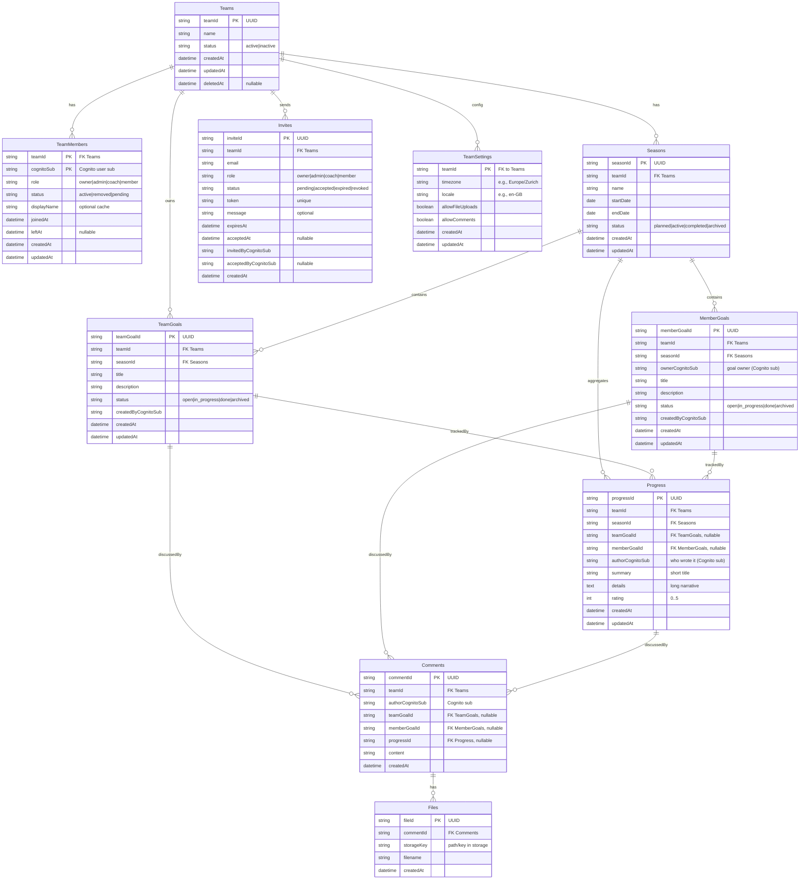
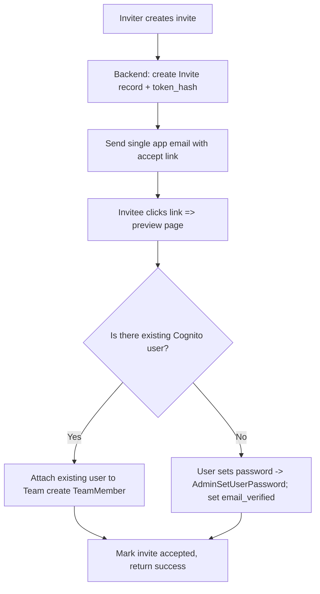
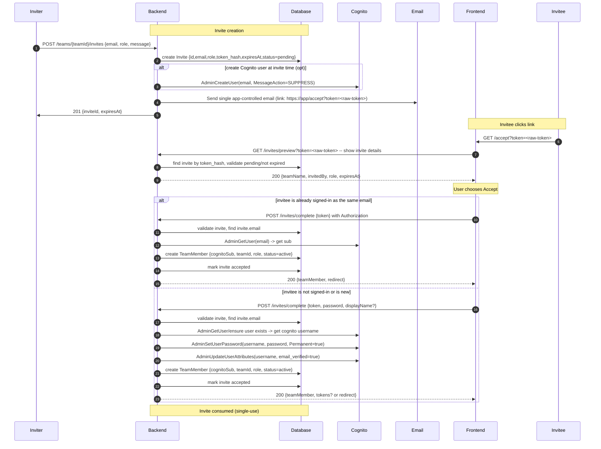

# terraform-volleygoals

This is the application Module for VolleyGoals, a web application for managing volleyball goals and statistics.
This module is designed to be used with Terraform to provision the necessary infrastructure on AWS.

## Prerequisites

- Terraform 1.0 or later
- AWS CLI configured with appropriate credentials

## Usage

## Database Diagram

The following diagram illustrates the database schema for the Volleyball Goal Management application:

## User Invite Flow

### Detailed
