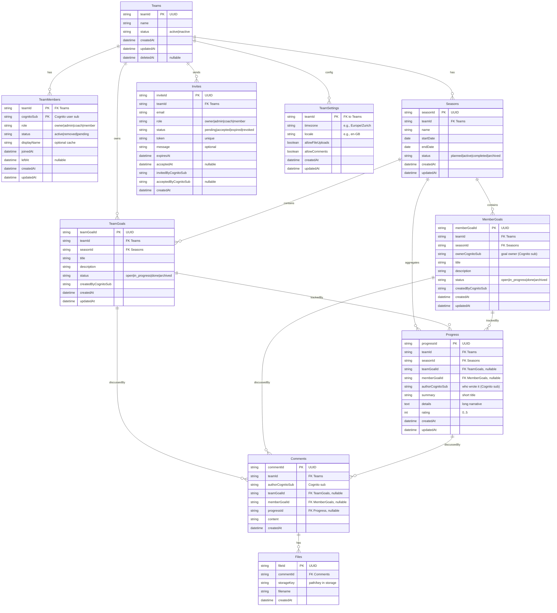
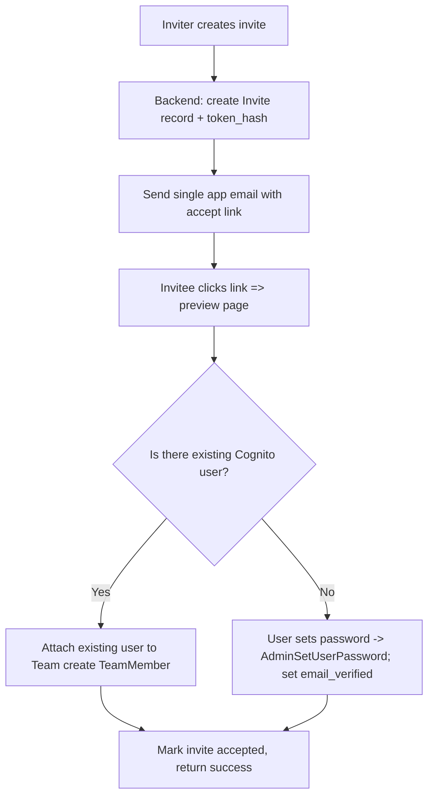
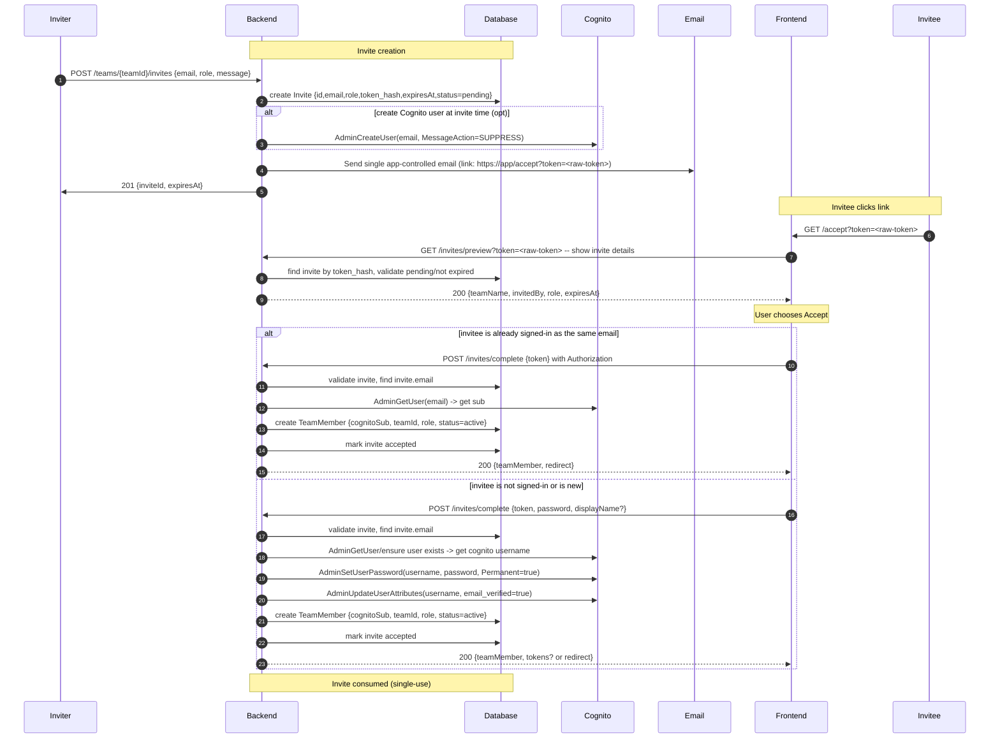

# terraform-volleygoals

Terraform module for **VolleyGoals** — a web application for managing volleyball team goals, seasons, and progress tracking. Provisions the full AWS infrastructure: API Gateway, Lambda (Go), DynamoDB, S3 + CloudFront CDN, SES, Route53, and CloudWatch monitoring.

## Prerequisites

- Terraform >= 1.10
- Go >= 1.23
- AWS CLI configured with appropriate credentials
- An AWS account with an S3 bucket for Terraform state

## Project Structure

```
.
├── environments/           # Per-environment configs (committed)
│   ├── dev/
│   │   ├── backend.hcl        # S3 state backend for dev
│   │   └── terraform.tfvars   # Variable values for dev
│   └── prod/
│       ├── backend.hcl        # S3 state backend for prod
│       └── terraform.tfvars   # Variable values for prod
├── files/src/              # Go source code (shared Lambda binary)
├── iam/                    # Reference IAM policy documents for OIDC setup
├── scripts/                # Cross-platform Go build scripts
├── .github/workflows/      # CI/CD pipelines
├── *.tf                    # Terraform configuration
└── README.md
```

## Variables

| Variable | Description | Default |
|----------|-------------|---------|
| `prefix` | Prefix for all resource names (e.g. `dev`, `prod`) | `"dev"` |
| `dns_zone_id` | Route53 Hosted Zone ID | *required* |
| `cognito_user_pool_arn` | Cognito User Pool ARN for API authorization | *required* |
| `ses_tenant_name` | SES tenant name | `"default_tenant"` |
| `tags` | Map of tags for all resources | `{}` |

## Local Development

Initialize Terraform with an environment-specific backend:

```bash
terraform init -backend-config=environments/dev/backend.hcl
```

Plan and apply with the corresponding tfvars:

```bash
terraform plan -var-file=environments/dev/terraform.tfvars
terraform apply -var-file=environments/dev/terraform.tfvars
```

## CI/CD Pipeline

The project uses GitHub Actions with OIDC-based AWS authentication. Separate AWS accounts are used for dev and prod.

### Branch Strategy

```
feature/* ──PR──▶ development ──PR──▶ main
                       │                  │
                    merge              merge
                       │                  │
                       ▼                  ▼
                  Plan + Apply      Plan + Apply
                  (dev, auto)      (prod, approval)
```

| Branch | Environment | AWS Account | Deploy Trigger |
|--------|-------------|-------------|----------------|
| `development` | dev | Dev account | Auto on merge |
| `main` | prod | Prod account | Manual approval required |

### Workflows

| Workflow | Trigger | Description |
|----------|---------|-------------|
| `terraform-plan.yml` | PR to `development` or `main` | Runs `terraform plan`, posts output as PR comment |
| `terraform-deploy.yml` | Push to `development` or `main` | Runs `terraform apply` (prod requires approval) |
| `test.yaml` | PR | Format check, validate, Go tests |

### Development Flow

1. **Create a feature branch** from `development`
2. **Open a PR** to `development` — plan runs automatically, plan output posted as comment
3. **Merge** — auto-deploys to dev environment
4. **Verify** changes work in dev

### Production Release

5. **Open a PR** from `development` to `main` — plan runs against prod
6. **Review** the plan carefully in the PR comment
7. **Merge** — deployment pauses at the GitHub Environment approval gate
8. **Approve** the deployment in GitHub Actions
9. Terraform applies to production

### Hotfix

For urgent fixes that can't go through the normal flow:

1. Branch from `main` (e.g. `hotfix/fix-name`)
2. PR directly to `main` — plan runs against prod
3. Merge and approve deployment
4. Back-merge `main` into `development` to keep branches in sync

### AWS OIDC Setup

Each AWS account needs:

1. **IAM OIDC Identity Provider** for `token.actions.githubusercontent.com`
2. **IAM Role** `github-terraform-deploy` with:
   - Trust policy from `iam/oidc-trust-policy.json` (scoped to GitHub Environment)
   - Permissions policy from `iam/deploy-permissions-policy.json`
3. **GitHub Environments** configured in repo settings:
   - `development` — no protection rules
   - `production` — required reviewers enabled

## Database Diagram


```mermaid
%% Cognito as IdP (no Users table). No Trainings yet. Comments/files simplified as requested.
erDiagram
  %% Relationships
  Teams ||--o{ TeamMembers : has
  Teams ||--o{ Seasons : has
  Teams ||--o{ TeamGoals : owns
  Teams ||--o{ Invites : sends
  Teams ||--o{ TeamSettings : config

  Seasons ||--o{ TeamGoals : contains
  Seasons ||--o{ MemberGoals : contains
  Seasons ||--o{ Progress : aggregates

  TeamGoals ||--o{ Progress : trackedBy
  MemberGoals ||--o{ Progress : trackedBy

  TeamGoals ||--o{ Comments : discussedBy
  MemberGoals ||--o{ Comments : discussedBy
  Progress ||--o{ Comments : discussedBy

  Comments ||--o{ Files : has

  %% Tables
  Teams {
    string teamId PK "UUID"
    string name
    string status "active|inactive"
    datetime createdAt
    datetime updatedAt
    datetime deletedAt "nullable"
  }

  TeamSettings {
    string teamId PK "FK to Teams"
    string timezone "e.g., Europe/Zurich"
    string locale "e.g., en-GB"
    boolean allowFileUploads
    boolean allowComments
    datetime createdAt
    datetime updatedAt
  }

  TeamMembers {
    string teamId PK "FK Teams"
    string cognitoSub PK "Cognito user sub"
    string role "owner|admin|coach|member"
    string status "active|removed|pending"
    string displayName "optional cache"
    datetime joinedAt
    datetime leftAt "nullable"
    datetime createdAt
    datetime updatedAt
  }

  Invites {
    string inviteId PK "UUID"
    string teamId "FK Teams"
    string email
    string role "owner|admin|coach|member"
    string status "pending|accepted|expired|revoked"
    string token "unique"
    string message "optional"
    datetime expiresAt
    datetime acceptedAt "nullable"
    string invitedByCognitoSub
    string acceptedByCognitoSub "nullable"
    datetime createdAt
  }

  Seasons {
    string seasonId PK "UUID"
    string teamId "FK Teams"
    string name
    date startDate
    date endDate
    string status "planned|active|completed|archived"
    datetime createdAt
    datetime updatedAt
  }

  TeamGoals {
    string teamGoalId PK "UUID"
    string teamId "FK Teams"
    string seasonId "FK Seasons"
    string title
    string description
    string status "open|in_progress|done|archived"
    string createdByCognitoSub
    datetime createdAt
    datetime updatedAt
  }

  MemberGoals {
    string memberGoalId PK "UUID"
    string teamId "FK Teams"
    string seasonId "FK Seasons"
    string ownerCognitoSub "goal owner (Cognito sub)"
    string title
    string description
    string status "open|in_progress|done|archived"
    string createdByCognitoSub
    datetime createdAt
    datetime updatedAt
  }

  %% Progress is tied to exactly one goal (team or member) and includes a 0..5 rating
  Progress {
    string progressId PK "UUID"
    string teamId "FK Teams"
    string seasonId "FK Seasons"
    string teamGoalId "FK TeamGoals, nullable"
    string memberGoalId "FK MemberGoals, nullable"
    string authorCognitoSub "who wrote it (Cognito sub)"
    string summary "short title"
    text details "long narrative"
    int rating "0..5"
    datetime createdAt
    datetime updatedAt
  }

  %% Comments attach to exactly one of TeamGoal, MemberGoal, or Progress
  Comments {
    string commentId PK "UUID"
    string teamId "FK Teams"
    string authorCognitoSub "Cognito sub"
    string teamGoalId "FK TeamGoals, nullable"
    string memberGoalId "FK MemberGoals, nullable"
    string progressId "FK Progress, nullable"
    string content
    datetime createdAt
  }

  %% Files only attach to comments
  Files {
    string fileId PK "UUID"
    string commentId "FK Comments"
    string storageKey "path/key in storage"
    string filename
    datetime createdAt
  }
```

## User Invite Flow


```mermaid
flowchart TD
  A[Inviter creates invite] --> B[Backend: create Invite record + token_hash]
  B --> C[Send single app email with accept link]
  C --> D[Invitee clicks link => preview page]
  D --> E{Is there existing Cognito user?}
  E -->|Yes| F[Attach existing user to Team create TeamMember]
  E -->|No| G[User sets password -> AdminSetUserPassword; set email_verified]
  F --> H[Mark invite accepted, return success]
  G --> H
```

### Detailed


```mermaid
sequenceDiagram
  autonumber
  participant Inviter
  participant Backend
  participant DB as Database
  participant Cognito
  participant Email
  participant Frontend
  participant Invitee

  Note over Backend,DB: Invite creation
  Inviter->>Backend: POST /teams/{teamId}/invites {email, role, message}
  Backend->>DB: create Invite {id,email,role,token_hash,expiresAt,status=pending}
  alt create Cognito user at invite time (opt)
    Backend->>Cognito: AdminCreateUser(email, MessageAction=SUPPRESS)
  end
  Backend->>Email: Send single app-controlled email (link: https://app/accept?token=<raw-token>)
  Backend->>Inviter: 201 {inviteId, expiresAt}

  Note over Invitee,Frontend: Invitee clicks link
  Invitee->>Frontend: GET /accept?token=<raw-token>
  Frontend->>Backend: GET /invites/preview?token=<raw-token>  -- show invite details
  Backend->>DB: find invite by token_hash, validate pending/not expired
  Backend-->>Frontend: 200 {teamName, invitedBy, role, expiresAt}

  Note over Frontend: User chooses Accept
  alt invitee is already signed-in as the same email
    Frontend->>Backend: POST /invites/complete {token} with Authorization
    Backend->>DB: validate invite, find invite.email
    Backend->>Cognito: AdminGetUser(email) -> get sub
    Backend->>DB: create TeamMember {cognitoSub, teamId, role, status=active}
    Backend->>DB: mark invite accepted
    Backend-->>Frontend: 200 {teamMember, redirect}
  else invitee is not signed-in or is new
    Frontend->>Backend: POST /invites/complete {token, password, displayName?}
    Backend->>DB: validate invite, find invite.email
    Backend->>Cognito: AdminGetUser/ensure user exists -> get cognito username
    Backend->>Cognito: AdminSetUserPassword(username, password, Permanent=true)
    Backend->>Cognito: AdminUpdateUserAttributes(username, email_verified=true)
    Backend->>DB: create TeamMember {cognitoSub, teamId, role, status=active}
    Backend->>DB: mark invite accepted
    Backend-->>Frontend: 200 {teamMember, tokens? or redirect}
  end

  Note over Backend,DB: Invite consumed (single-use)
```
